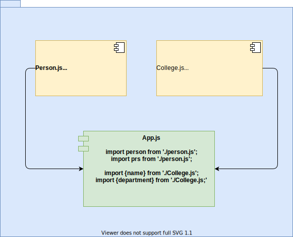

# web-components

What are web-components, how to create and work with them.

## What are web components?

- Custom html elements, which are not built in to a browser.
- These tags are built by developers on their own, to perform a specific ui function.
- Web components basically follow few specifications they are
  - **Custom HTML elements** which are elements or tags created by developers.
  - **Shadow DOM** Maintaining a separate node tree for the custom html element created including the scoped css styles.
  - **Templates and** slots writing templates that can be added to html elements, slots are like entry points for templates.
  - **HTML imports** importing html contents to other html files. _This is no longer supported(Due to evolving tech stack)_

## why do we need web components:

- Web components encapsulates, logic an UI together.
  - It is easy to understand
  - Easy to maintain
  - concerns and issues can be separated.
- Re-usable across pages
  - We can use them like html tags.
  - No worries about over lapping logic
  - Write once and use many times
- Re-usable between apps and projects
  - can be used between frameworks like react and angular
  - can be published as packages to npm for future use.

## Comparing web components with frameworks and libraries

| ref      | Libraries                       | Frameworks                                      | web components                                  |
| -------- | ------------------------------- | ----------------------------------------------- | ----------------------------------------------- |
| example  | jquery                          | angular, react vue                              | web-components need to be built manually        |
| Approach | Component driven approach       | Component driven approach                       | Component driven approach                       |
| pros     | drop in and ready to go         | routing and state management can be implemented | Vanilla javascript no dependencies              |
| pros     | na                              | Clear set of codes and cleaner code             | Easily re-usable                                |
| Cons     | many imports, version conflicts | Complexity, takes time to learn                 | Complexity, takes time to learn                 |
| Cons     | Redundant code                  | Components not re-usable in other frameworks    | only components no routing or state management. |

### Libraries

Libraries are like plug and play, but even though we do not use entire code, we need to import all the bundle.

### Frameworks

Frameworks will provide component driven arch but the same component need to be written again from scratch, If apps are using different frameworks in the same organization.

### Web-components

Web component can be created once and used in any framework, as built using vanilla javascript no need of bulk imports.

> With web components we can only develope a particular component for usage, but we cannot create an entire UI. External libraries or frameworks need to be incorporated if we need to built an entire ui.

## Javascript ES6

### let and const key words

- let is a keyword used instead of var.
- Const keyword is used to assign a variable only once. if we try to assign variable again it will through error.

> To try simple java script code online we can try [jsbin](http://jsbin.com/?js,console). Shortcut to run code in jsbin is 'Ctrl+enter'.

### Arrow function

- Fancy way of creating a function in java script, ways of writing an arrow function in explained below in the code.
- We can call it as anonymous function invocation.

```javascript
//example javascript function
function logMessage() {
  console.log("Initial log message");
}
logMessage();

// The same can be converted into arrow function as
const logMessage01 = () => {
  console.log("Initial log message");
};
logMessage01();

// If we have a single input we can write it in few ways
const logMsg = (msg) => {
  console.log(msg);
};
logMsg("1st way of single input");

// 2nd way
// This will work only if we have single input if multiple inputs are present encapsulate them in ()
const logMsg02 = (msg) => {
  console.log(msg);
};
logMsg02("2nd way of single input");

//3rd way
const logMsg03 = (msg) => console.log(msg);
logMsg03("3rd way of single input");

//Both the below functions serve same way if we have multi line code encapsulate them with {} on right side of arrow function
const multiply01 = (val) => val * 3;
console.log(multiply01(4));
const multiply02 = (val) => {
  return val * 3;
};
console.log(multiply02(4));
```

### import and exports

- We can write javascript in multiple files and use them with the key words import to use it in a file and export to export a method in a file.



- In the above example person can be imported with any name, because it uses the default key word. which says, any name we use to import from person.js will import thr name function.
- From college.js we need to import by using the exact name, we have imported name and department from them. in two separate imports. We can use a single line also and import as `import {name, department} from './College.js'`

We can also import like

```javascript
import {name as colName } from './college.js';
import { * as group} from './college.js';
```

- \* will import all the exported functions as group and we can use them as 'group.name', 'group.department' based on our requirement.

### Classes

- These are blue print of object or data same like any other object oriented programming.
- classes contains variables and functions.
- one class can inherit another call by using the extends keyword.
- a class will have a default function called constructor. When we instantiate a class this function is called.
- While extending a class in the constructor of the inheriting class you need to use super(); to run constructor code of inherited class.
- Instance of class is created by using new keyword

**Example code:**

```javascript
//Parent class
class vehicle {
  constructor() {
    this.colour = "black";
  }

  printColour() {
    console.log("colour of vehicle is : " + this.colour);
  }
}

//Child Class
class heavyVehicle extends vehicle {
  constructor() {
    //Executing parent class constructor or code
    super();
    //Overriding parent class variable
    this.colour = "orange";
    this.type = "8-wheeler";
  }

  printType() {
    console.log("Type of vehicle is : " + this.type);
  }
}

//Instantiating Class
const vec = new heavyVehicle();
vec.printColour();
vec.printType();
```

### Usage of classes, properties and methods

| ref | properties are variables attached to classes | methods are functions attached to classes |
| --- | -------------------------------------------- | ----------------------------------------- |
| ES6 | constructor() { this.myProperty = 'value'; } | method() { ... }                          |
| ES7 | myProperty = 'value'                         | method = () => { ... }                    |

**Next gen interpretation of code**

```javascript
//Parent class
class vehicle {
  colour = "black";

  printColour = () => {
    console.log("colour of vehicle is : " + this.colour);
  };
}

//Child Class
class heavyVehicle extends vehicle {
  //Overriding parent class variable
  colour = "orange";
  type = "8-wheeler";

  printType = () => {
    console.log("Type of vehicle is : " + this.type);
  };
}

//Instantiating Class
const vec = new heavyVehicle();
vec.printColour();
vec.printType();
```

### Spread and rest operator '...'

#### Spread

- Used to split up array or object properties

```JavaScript
const newArray = [...oldArray,1,2];
const newObj = {...oldObj, newProp: 10};
```

#### rest

- Used to merge a list of array arguments to an array

```javascript
function sortArray(...args) {
  return args.sort();
}
```

**Example for Spread and rest**

```javascript
//Spread
let oldArray = [1, 2, 3];
let newArray = [...oldArray, 4];

console.log(newArray);

let oldObj = {
  name: "test",
  dept: "test",
};
let newObj = {
  ...oldObj,
  sector: "it",
};

console.log(newObj);

//Rest
const newTest = (...abc) => {
  return abc.filter((el) => el === 1);
};
console.log(newTest(1, 2, 3, 4));
```
> Array in java script have multiple function on it reference can be found at [Morzilla Array ref](https://developer.mozilla.org/en-US/docs/Web/JavaScript/Reference/Global_Objects/Array). Like map, pop, push.

### JS Array Functions

Not really next-gen JavaScript, but also important: JavaScript array functions like map() , filter() , reduce()  etc.

The following page gives a good overview over the various methods you can use on the array prototype - feel free to click through them and refresh your knowledge as required: https://developer.mozilla.org/en-US/docs/Web/JavaScript/Reference/Global_Objects/Array

Particularly important in this course are:

    map()  => https://developer.mozilla.org/en-US/docs/Web/JavaScript/Reference/Global_Objects/Array/map

    find()  => https://developer.mozilla.org/en-US/docs/Web/JavaScript/Reference/Global_Objects/Array/find

    findIndex()  => https://developer.mozilla.org/en-US/docs/Web/JavaScript/Reference/Global_Objects/Array/findIndex

    filter()  => https://developer.mozilla.org/en-US/docs/Web/JavaScript/Reference/Global_Objects/Array/filter

    reduce()  => https://developer.mozilla.org/en-US/docs/Web/JavaScript/Reference/Global_Objects/Array/Reduce?v=b

    concat()  => https://developer.mozilla.org/en-US/docs/Web/JavaScript/Reference/Global_Objects/Array/concat?v=b

    slice()  => https://developer.mozilla.org/en-US/docs/Web/JavaScript/Reference/Global_Objects/Array/slice

    splice()  => https://developer.mozilla.org/en-US/docs/Web/JavaScript/Reference/Global_Objects/Array/splice

